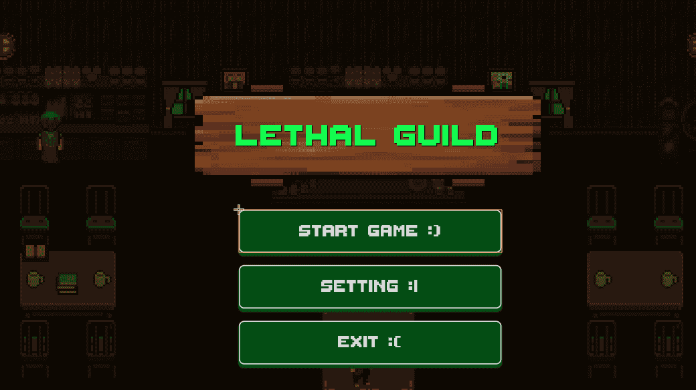
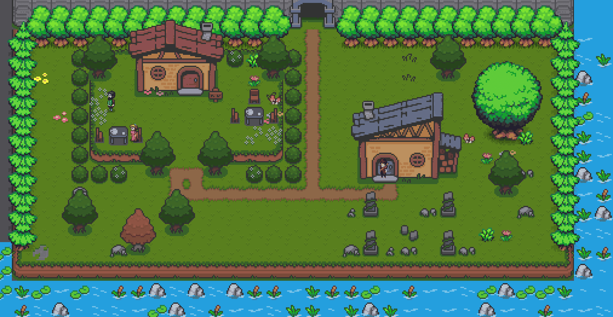
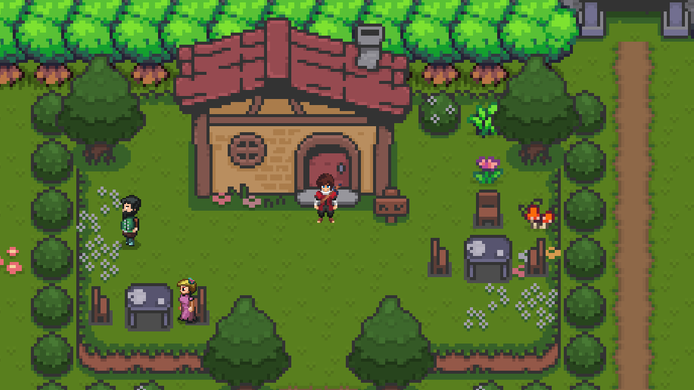
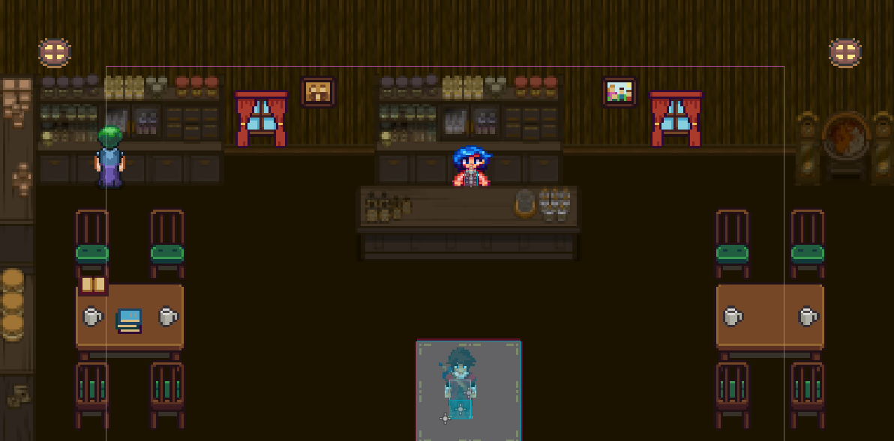
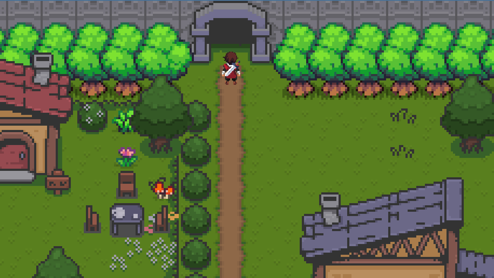

# lethal-guild

Lethal Guild is a **2D top-down Action RPG dungeon crawler** with roguelite progression elements.  
Start as a weak, talentless adventurer and climb the ranks of a brutal guild by surviving increasingly dangerous dungeon floors.

---

##  Game Overview

| Field | Details |
|-------|---------|
| **Genre** | Action RPG / Dungeon Crawler / Roguelite |
| **Perspective** | 2D Top-Down |
| **Mode** | Single-player |
| **Setting** | Medieval Fantasy |
| **Engine** | Godot 4 |
| **Target Audience** | RPG & Dungeon Crawler fans (Age 13+) |

---

##  Story

A countryside boy, born weak and without talent, dreams of becoming a legendary dungeon explorer.  
After years of training with nothing to show for it, he joins the **Adventurers’ Guild — Lethal Guild** at the lowest possible rank: **F-Rank**.

Restricted to the safest dungeon floors and weakest monsters, he takes on quests to gain experience, reputation, and strength.  
Each completed quest raises his rank, unlocking deeper dungeon floors filled with deadlier monsters and harsher trials.

> **Can a talentless adventurer conquer every floor and rise to S-Rank?**

---

##  Screenshots of The Game

The Game Main Menu


The Overworld


The Entrance to Lethal Guild


The Lethal Guild


The Entrance to The Dungeon


## Video of The Game
Lethal Guild Gameplay Release Version

[](https://www.youtube.com/watch?v=t-wGdw07M2I)

Lethal Guild Gameplay Release Version with Explanation

[](https://www.youtube.com/watch?v=rzXf9bIlmg0)

---
## Game Assets

### Characters & Sprites

| Asset | Creator |
|-------|---------|
| [Top Down Adventurer Character](https://xzany.itch.io/top-down-adventurer-character) | xzany |
| [Adventure Pack](https://o-lobster.itch.io/adventure-pack) | o-lobster |

### Tilesets & Environments

| Asset | Creator |
|-------|---------|
| [Mystic Woods](https://game-endeavor.itch.io/mystic-woods) | Game Endeavor |
| [Old Shop Tile Set](https://gabrielatot.itch.io/old-shop-tile-set) | gabrielatot |
| [Pixel Lands Interiors](https://trislin.itch.io/pixel-lands-interiors) | trislin |
| [Pixel 16 Woods v2](https://zedpxl.itch.io/pixelart-forest-asset-pack/devlog/923296/pixel-16-woods-v2-released) | zedpxl |

### UI & Icons

| Asset | Creator |
|-------|---------|
| [Raven Fantasy Icons](https://clockworkraven.itch.io/raven-fantasy-icons) | ClockworkRaven |
| [Complete UI Book Styles Pack](https://crusenho.itch.io/complete-ui-book-styles-pack) | crusenho |

### Fonts

| Asset | Creator |
|-------|---------|
| [Free Pixel Font – Thaleah](https://tinyworlds.itch.io/free-pixel-font-thaleah) | Tiny Worlds |
| [Monogram](https://datagoblin.itch.io/monogram) | datagoblin |

### Audio

| Asset | Source |
|-------|--------|
| [Medieval Happy Music](https://pixabay.com/music/adventure-medieval-happy-music-412790/) | Pixabay |
| [Medieval Ambient](https://pixabay.com/music/ambient-medieval-ambient-236809/) | Pixabay |
| [Slime Monster Sound Effects](https://pixabay.com/sound-effects/horror-slime-monster-noises-66776/) | Pixabay |


---

### Installation & Running
**Prerequisites**
- [Godot Engine 4.5.x or later](https://godotengine.org/download)

**Clone via Git**
```bash
# Clone the repo
git clone https://github.com/Rithy404/lethal-guild

# Navigate to project folder
cd lethal-guild
```
## AI Usage
Claude Prompt:
- In godot 4 I want to make the player hit a dummy only when its close by and facing the dummy. My idea of implement this is by detect player location and compare it to the dummy location. Example: if the player walk passed it need to face the direction behind him to hit it.
- How to make dialog system for npc similar to undertale
- I want to add an interactable button when dialog have question we can pick yes or no
- I want to add a healthbar to the test dummy
- I want to add hp bar to player help adjust the script
- I want to create a way to test player just add area2d player enter deduct health
- Now I want to make the show_quest_ui() code here is my current nodes structure and here is how the UI looks like
- why need to use the get node or null here?
- I want to test the AcceptButton ( I change the name from textureButton to AcceptButton) when player click on the it should print the description of the quest in the console also for some reason the questboard UI close button not working
- I want to make the quest show on player UI not just printing out in the console this is what I got rn
---
## License

This project is for educational purposes.
All third-party assets belong to their respective creators.
